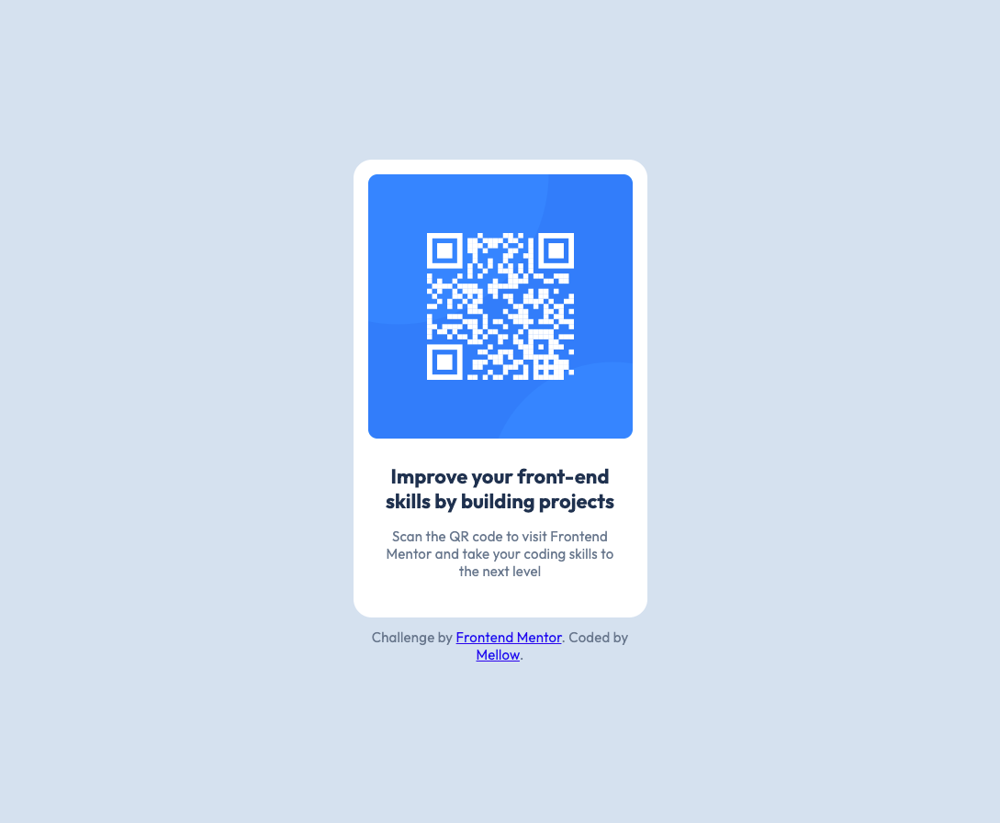

# Frontend Mentor - QR code component solution

This is a solution to the [QR code component challenge on Frontend Mentor](https://www.frontendmentor.io/challenges/qr-code-component-iux_sIO_H). Frontend Mentor challenges help you improve your coding skills by building realistic projects. 

## Table of contents

- [Overview](#overview)
  - [Screenshot](#screenshot)
  - [Links](#links)
- [My process](#my-process)
  - [Built with](#built-with)
  - [What I learned](#what-i-learned)
  - [Continued development](#continued-development)
- [Author](#author)

**Note: Delete this note and update the table of contents based on what sections you keep.**

## Overview

### Screenshot



### Links

- Solution URL: [Solution URL](https://www.frontendmentor.io/solutions/qr-code-component-HPEipgNyxb)
- Live Site URL: [Live site URL](https://mell-o.github.io/qr-code-component-main/)

## My process

### Built with

- Semantic HTML5 markup
- CSS custom properties
- Flexbox

### What I Learned

Got it 👍 — here’s the updated polished version with that extra lesson about **avoiding overly high paddings** worked in:

---

### What I Learned

One of the biggest takeaways from this project was learning how to use `clamp()` for responsive layouts — and also where it can backfire.

`clamp(min, preferred, max)` is powerful because it lets values grow fluidly with the viewport (using units like `vw` or `vh`) but never shrink below a minimum or exceed a maximum. This makes it great for paddings, margins, and font sizes.

Thanks to community feedback, I discovered that using `clamp()` on vertical paddings (`padding-top` / `padding-bottom`) can cause the page’s total height to **exceed the viewport**. On wider desktop screens, the preferred value can grow so large that the sum of top and bottom padding pushes the body taller than `100vh`, leading to unwanted vertical scroll bars. I also realized I had mistakenly used `vw` (viewport width) for vertical spacing when I should have been using `vh` (viewport height), which exaggerated the problem further.

In addition to using the correct units, I also learned the importance of avoiding excessively large paddings in general — smaller, well-bounded values scale better and keep layouts from breaking across devices.

To handle proportional scaling more safely, I used this formula:


mobile padding = desktop padding × (mobile width ÷ desktop width)

For example, a top padding of `230.5px` at `1440px` scales down to about `60px` at `375px`.

Here’s how I implemented it with `clamp()` to keep it fluid but bounded:

```css
padding-top: clamp(60px, 16vh, 230.5px);
padding-bottom: clamp(60px, 16vh, 230.5px);
padding-left: clamp(146px, 39vw, 560px);
padding-right: clamp(146px, 39vw, 560px);
```

This experience taught me that while `clamp()` is fantastic for responsive scaling, it’s critical to use the correct units, test carefully to avoid layouts taller than the viewport, and avoid relying on oversized paddings for spacing.


### Continued development

I want to keep sharpening my eye for detail by challenging myself to recreate layouts and solutions as closely as possible to the intended design before consulting the design files. This will push me to rely more on observation and judgment, helping me catch subtle spacing, alignment, and scaling issues earlier and build more intuitive, design-accurate code.

## Author

- Frontend Mentor - [@Mell-o](https://www.frontendmentor.io/profile/Mell-o)


## Acknowledgements

A special thanks to [@TisteEdur](https://www.frontendmentor.io/profile/TisteEdur) for pointing out the padding and unit issues that helped me identify why the layout was exceeding the viewport height.  
